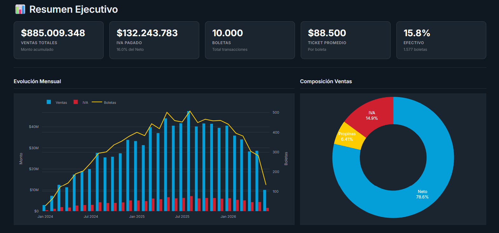
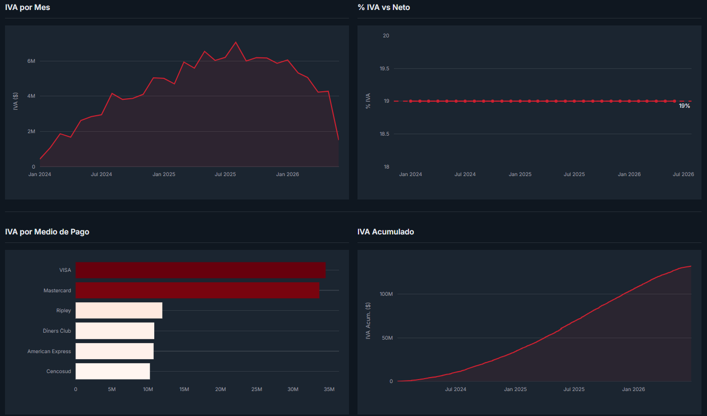
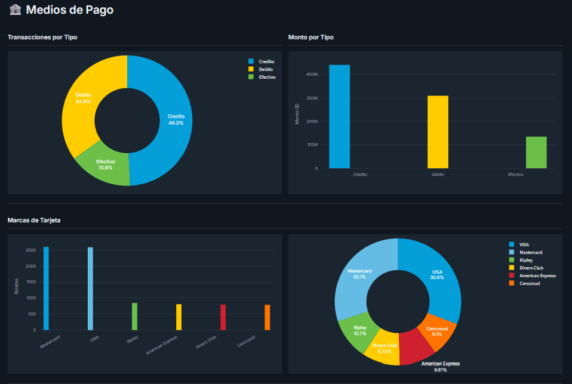

# PulpFiction 2.0 — Dashboard de Boletas Electrónicas

[](https://hotelpulpfictionv2dashboard.streamlit.app)
[](https://github.com/VasquezMaldonadoSebastian/HotelPulpFictionV2)
[](https://python.org)
[](LICENSE)

Dashboard analítico orientado a la detección y corrección de errores en IVA declarado sobre boletas electrónicas. Construido sobre 10,000 registros que replican la estructura real del sistema Transbank chileno, con foco en conciliación fiscal y análisis de medios de pago.

---

## Contexto del Problema

Un error en el sistema de ventas registró el IVA duplicado durante un período prolongado, distorsionando las declaraciones mensuales ante el Servicio de Impuestos Internos (SII).

El proceso manual — descargar boletas una por una desde Transbank, consolidar en Excel, calcular diferencias — tomaba días y era propenso a errores. Se necesitaba automatizar la extracción, estandarizar el análisis y centralizar la información para poder comparar el IVA real contra el declarado.

Este proyecto implementa la primera etapa de esa solución: **un pipeline de recopilación y análisis que transforma datos crudos de boletas electrónicas en un dashboard interactivo**, listo para escalar hacia conciliación fiscal y generación de reportes SII.

---

## Demo en Vivo

[https://hotelpulpfictionv2dashboard.streamlit.app](https://hotelpulpfictionv2dashboard.streamlit.app)

### Vistas del Dashboard

| [→ Dashboard en vivo](https://hotelpulpfictionv2dashboard.streamlit.app) |
|:---:|
|  ·  ·  |
| 5 KPIs (ventas, IVA, boletas, ticket prom., % efectivo) + evolución mensual con barras agrupadas + composición ventas en gráfico donut + tabla de indicadores mensuales | IVA por mes en área, % IVA vs Neto con línea de referencia 19%, IVA por medio de pago en barras horizontales, e IVA acumulado en área | Ventas diarias (barras) y mensuales (línea con relleno), heatmap de actividad por día y hora, ticket promedio diario, y resumen de ventas en KPIs |

---

## Resultados Clave

| Métrica               | Valor                        |
|-----------------------|:----------------------------:|
| Total facturado       | **$887 MM**                  |
| Registros procesados  | **10,000**                   |
| Período               | Ene 2024 → Jun 2026 (30 m)   |
| IVA recaudado         | **$132.6 MM**                |
| Propinas              | $10,358 prom. (54.9% boletas)|
| Validación            | 0 errores (13 chequeos)      |

---

## Pipeline

```
Transbank ──► Extracción ──► Transformación ──► Carga ──► Dashboard
(simulado)     (automática)    (estandarización)  (SQLite)   (Streamlit)
```

El flujo replica el proceso real: los datos se extraen desde el sistema transaccional, se normalizan a un esquema uniforme de 28 columnas, se validan contra 13 reglas de integridad, y se cargan en una base de datos consumida directamente por el dashboard.

---

## Dashboard — Secciones

| Vista               | Descripción                                              |
|---------------------|----------------------------------------------------------|
| Resumen Ejecutivo   | KPIs, evolución mensual ventas + IVA + boletas            |
| IVA                 | IVA por mes, % vs Neto, acumulado, por medio de pago      |
| Ventas              | Diaria / semanal / mensual, heatmap día×hora              |
| Medios de Pago      | Débito vs Crédito vs Efectivo, marcas, cuotas, propinas   |
| Detalle             | Tabla filtrable por N° boleta, operación, montos, fechas  |

Filtros globales: rango de fechas, medio de pago, tipo de pago, rango de montos.

---

## Stack Tecnológico

| Tecnología   | Propósito                     |
|--------------|-------------------------------|
| Python 3.11  | Lenguaje principal            |
| Streamlit    | Framework de dashboard        |
| Plotly       | Gráficos interactivos         |
| Pandas       | Transformaciones y agregaciones|
| SQLite       | Base de datos analítica       |

---

## Inicio Rápido

```bash
git clone https://github.com/VasquezMaldonadoSebastian/HotelPulpFictionV2.git
cd HotelPulpFictionV2
pip install -r requirements.txt
streamlit run dashboard/app.py
```

La base de datos precargada está incluida. No requiere generar datos ni configurar conexiones.

---

## Estructura del Proyecto

```
pulp-fiction-v2/
├── assets/
│   ├── dashboard-resumen.png   # Captura vista Resumen
│   ├── dashboard-iva.png       # Captura vista IVA
│   └── dashboard-ventas.png    # Captura vista Ventas
├── dashboard/
│   └── app.py                  # Dashboard Streamlit (5 vistas)
├── data/
│   ├── schema.sql              # Esquema de base de datos
│   └── pulp-fiction-v2.db      # Datos precargados (10,000 registros)
├── requirements.txt
└── README.md
```

---

## Notas

> Los datos incluidos son 100% sintéticos. Este proyecto demuestra el modelo de datos, el pipeline analítico y las visualizaciones necesarias para la conciliación de IVA en boletas electrónicas chilenas. En un entorno real, los datos provendrían de la descarga automatizada desde Transbank y contendrían información fiscal real protegida por secreto tributario.

El alcance de este proyecto cubre desde la recepción de datos crudos hasta el dashboard analítico. La etapa de comparación contra declaraciones SII y generación de reportes formales queda fuera del alcance actual.

---

## Licencia

MIT — Libre para usar, modificar y compartir.
